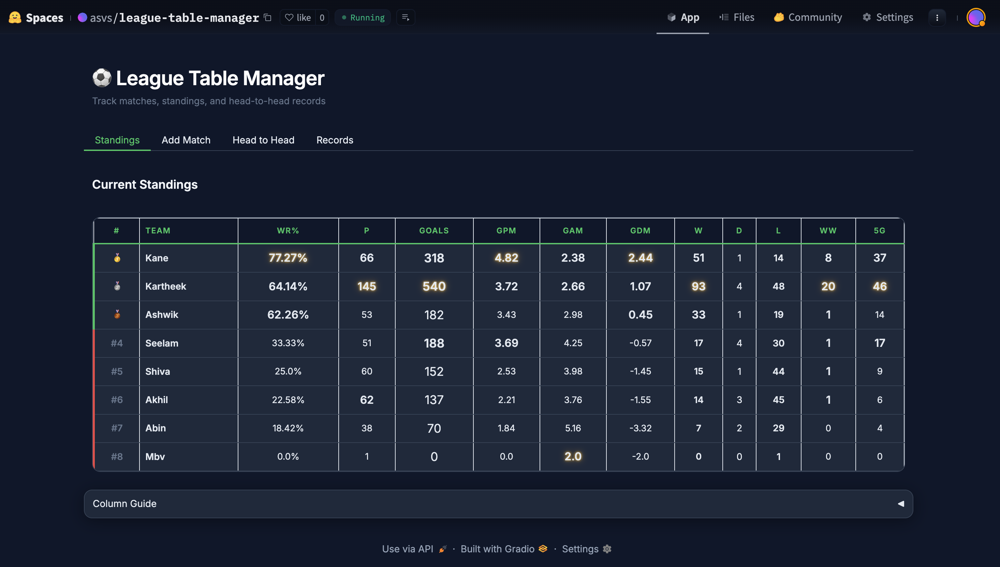
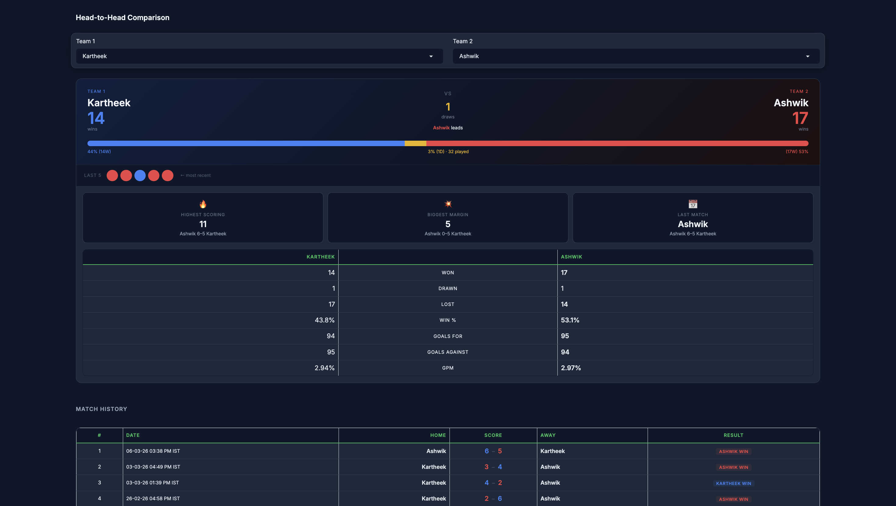
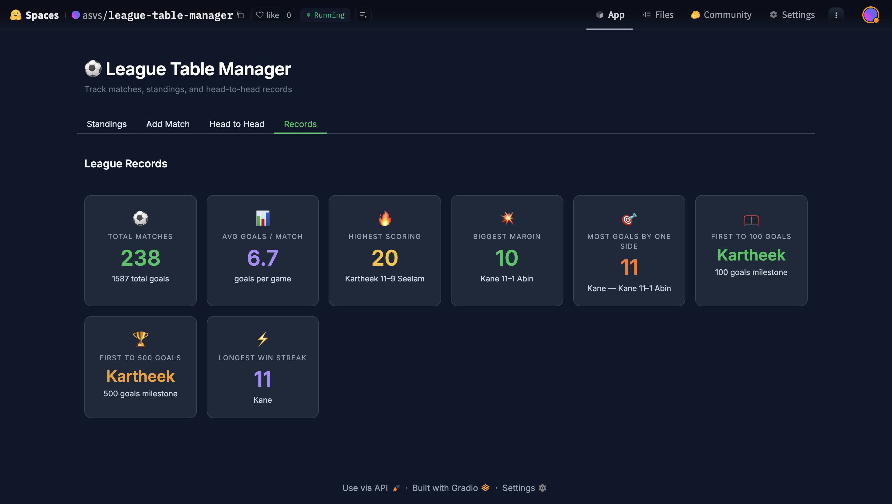
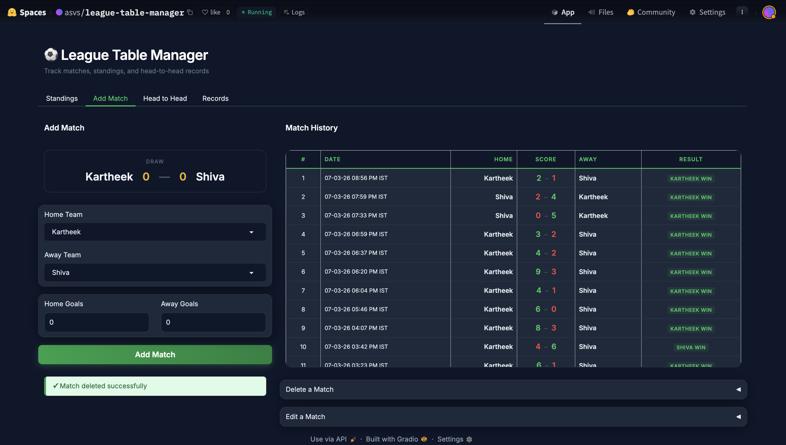

# League Table Manager

> Track your football friend group's matches, standings, and records — free, private, and yours.

[](https://huggingface.co/spaces/asvs/league-table-manager)
[](LICENSE)

[](https://huggingface.co/spaces/asvs/league-table-manager?duplicate=true)

---



---

## What is this?

My group of friends plays football every week. After 200+ matches we had no way to know who was actually dominating — so I built this.

It tracks every result, keeps a live standings table sorted by win rate, lets you compare any two players head-to-head, and surfaces fun records like longest win streak and highest-scoring games.

It's free. It's private. And you can have your own copy running in under 10 minutes.

---

## Screenshots

| Head to Head | Records |
|---|---|
|  |  |



---

## Set Up Your Own (Free, No Coding)

You need two free accounts: **Supabase** (stores your data) and **Hugging Face** (runs the app). Both have free tiers with no time limits.

---

### Step 1 — Set up your database (Supabase)

1. Go to [supabase.com](https://supabase.com) and create a free account.
2. Click **New project**, give it any name (e.g. `my-league`), set a password, pick your region, and wait ~1 minute.
3. In the left sidebar, click **SQL Editor** → **New query**. Paste the following and click **Run ▶**:

```sql
create table matches (
  id          bigint primary key generated always as identity,
  home        text not null,
  away        text not null,
  home_goals  integer not null default 0,
  away_goals  integer not null default 0,
  datetime    timestamptz not null default now(),
  updated_at  timestamptz
);
```

You should see **"Success. No rows returned."** — that means it worked.

4. Go to **Project Settings** (gear icon) → **API**. Copy these two values somewhere:
   - **Project URL** — looks like `https://abcdefgh.supabase.co`
   - **anon public** key — a long string starting with `eyJ...`

---

### Step 2 — Deploy the app (Hugging Face)

1. Click the **Duplicate this Space** button at the top of this page (or [click here](https://huggingface.co/spaces/asvs/league-table-manager?duplicate=true)).
2. Sign in or create a free Hugging Face account if prompted.
3. Choose a name for your copy and set visibility to **Private**.
4. In the **Variables and secrets** section, add:

   | Name | Value |
   |---|---|
   | `SUPABASE_URL` | Your Project URL from Step 1 |
   | `SUPABASE_KEY` | Your anon key from Step 1 |

5. Click **Duplicate Space**.

After 1–2 minutes your app will be live at `https://huggingface.co/spaces/YOUR_USERNAME/YOUR_SPACE_NAME`. Bookmark it on your phone.

---

### Using the app

1. Go to **Add Match** — type in player names and the score.
2. **Standings** updates automatically after every match.
3. **Head to Head** — pick any two players to see their full history and form.
4. **Records** — see league-wide milestones like longest win streak and top scorer.

---

## Troubleshooting

**The app is stuck on "Building..."**
That's normal on first deploy — it's installing dependencies. Give it 2–3 minutes. If it turns red, click **Logs**.

**"Error connecting to database"**
Your Supabase credentials aren't set correctly. Go to your Space → **Settings** → **Repository secrets** and check `SUPABASE_URL` and `SUPABASE_KEY`.

**I forgot to add the secrets before duplicating**
Go to your Space → **Settings** → **Repository secrets** → add them there, then click **Factory reboot**.

---

## FAQ

**Is this really free?**
Yes. Supabase free tier covers far more than a friend group will ever need. Hugging Face free CPU Spaces have no time limits.

**Can other people add matches?**
If your Space is **Private**, only you and people you explicitly invite can access it. If **Public**, anyone with the URL can add and edit matches.

**What if I delete the Space by accident?**
Your data lives in Supabase — it's safe. Just duplicate the Space again with the same credentials and all your match history will be there.

**Can I rename teams?**
Team names are just whatever you type when adding a match. Keep spelling consistent and it all works.

---

## Contributing

Want to run this locally or contribute to the code? See [CONTRIBUTING.md](CONTRIBUTING.md).

---

## License

MIT — free to use, modify, and share. See [LICENSE](LICENSE).
